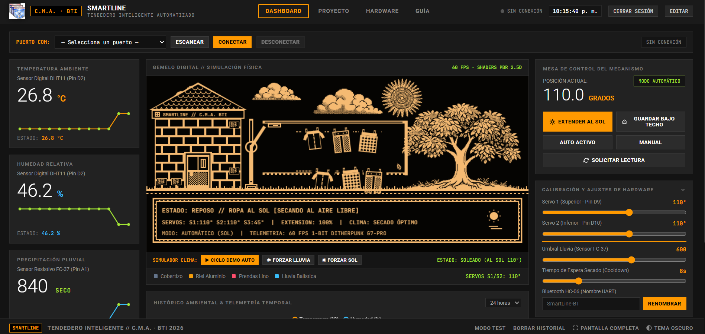

<div align="center">

# SMARTLINE

### Tendedero Inteligente Automatizado


Dashboard local, simulación interactiva y supervisión de un prototipo escolar
de tendedero automatizado basado en Arduino.

[**DESCARGAR SMARTLINE PARA WINDOWS**](https://github.com/hfreedo/Tendedero-Inteligente/releases/latest)

</div>

---

## Vista previa



## Funciones principales

| Área | Función |
|---|---|
| Dashboard | Telemetría ambiental, estado del mecanismo y controles locales |
| Gemelo digital | Representación gráfica del tendedero y su protección climática |
| Modo demostración | Recorrido de la interfaz mediante datos simulados, sin Arduino |
| Hardware | Comunicación serial con Arduino y apoyo para controlador CH340 |
| Distribución | Paquete portable para Windows, sin instalación de Python |

## Descargar y ejecutar

1. Abre la sección [**Releases**](https://github.com/hfreedo/Tendedero-Inteligente/releases).
2. Descarga `SmartLine_Tendedero_Inteligente_v1.0.0_Windows_Portable.zip`.
3. Extrae completamente el ZIP en una carpeta local.
4. Lee `LEEME_INICIO_RAPIDO.txt`.
5. Ejecuta `Iniciar_SmartLine.bat` o `SmartLine.exe`.

> [!IMPORTANT]
> No ejecutes SmartLine directamente dentro del ZIP. Cambia las credenciales
> iniciales antes de utilizarlo en una red compartida y no expongas el puerto
> 8000 directamente a Internet.

## Distribución protegida

Este repositorio publica solamente la presentación y los paquetes ejecutables
de **Releases**. No contiene el código fuente del proyecto ni el firmware
Arduino.

El paquete `v1.0.0` fue saneado antes de su publicación:

- sin archivos `.ino`, `.py`, `.pyw`, `.c`, `.cpp` o `.h`;
- sin base de datos histórica ni archivo de usuarios del equipo de desarrollo;
- con guía de inicio y dependencias necesarias para la ejecución local;
- con comprobación de arranque y respuesta HTTP 200 del dashboard.

**SHA-256 del ZIP v1.0.0**

```text
1D7E57D3A8B1C749E3D46BC92F5CDE0D5ADB1C53ACC6C209AE45D8D5A0294826
```

## Alcance académico

SmartLine es un prototipo educativo y experimental. El modo de demostración
utiliza datos simulados; no equivale a una medición física ni a una validación
industrial. La integración completa con el hardware debe verificarse en banco.

---

<div align="center">

**C.M.A. · BTI 2026**

</div>
